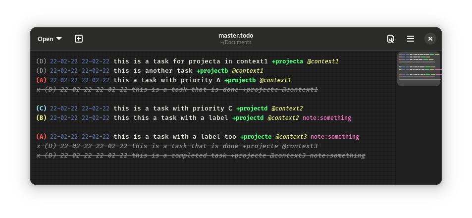

# Todo.txt

[Todo.txt](https://github.com/todotxt/todo.txt/blob/master/README.md) is a plaintext [GTD](https://hamberg.no/gtd/) system meant for a focused, undistracted workflow. Supported by GTKSourceView-compliant editors such as Gedit and Gnome Text Editor.

## Installation and Usage

Todo is easy to install (and uninstall) and has no dependencies. Feel free to delete the folder cloned by the installation commands after you're done installing. 

### GTKSourceView Language

#### GTKSourceView 4

```bash
git clone https://github.com/Positron11/todo.git
sudo mv todo/GTKSourceView-4/todo.lang /usr/share/gtksourceview-4/language-specs/
sudo chmod 0644 /usr/share/gtksourceview-4/language-specs/todo.lang
```

#### GTKSourceView 5

```bash
git clone https://github.com/Positron11/todo.git
sudo mv todo/GTKSourceView-5/todo.lang /usr/share/gtksourceview-5/language-specs/
sudo chmod 0644 /usr/share/gtksourceview-5/language-specs/todo.lang
```

Select Todo in your editor's language selector, and save files with the `.todo` extension.

### GTKSourceView Colour Scheme

To make use of Todo.txt's styling, you'll need to use a color scheme that supports Todo. At present, the only such schemes are the [Agenwulf color schemes](https://github.com/Positron11/agenwulf-color-scheme) (as shown in the example image - available in light and dark mode)

## Syntax

Todo.txt is entirely unstructured - none of the elements below are strictly necessary, and the order in which they appear is not fixed (with the exception of the completion status mark), although certain [guidelines](https://github.com/todotxt/todo.txt/blob/master/README.md#todotxt-format-rules) are recommended to be followed (just stick to the order given in the examples below, and you'll be set). This language spec does however require all elements to be separated by a space, and not contain any spaces themselves. See below for basic syntax guidelines.

### Priority

<pre><b style="font-size: 1.2em">(A)</b> 22-02-22 22-02-22 this is a task +project @context note:something</pre>

Tasks are assigned alphabetical priorities, with `A` generally being the highest. Priorities come before all other elements. This language spec file recognizes 4 priorities, `A`, `B`, `C`, and `D` (capitalization important), each assigned to a quadrant of the Eisenhower matrix:

- `A`: Important, and urgent

- `B`: Urgent, but not important

- `C`: Important but not urgent

- `D`: Not imortant or urgent

### Completion & Creation Dates

<pre>(A) <b style="font-size: 1.2em">22-02-22 22-02-22</b> this is a task +project @context note:something</pre>

You may mention a task's completion and creation (preferably in this order) dates.

### Task

<pre>(A) 22-02-22 22-02-22 <b style="font-size: 1.2em">this is a task</b> +project @context note:something</pre>

A description of the task itself.

### Project

<pre>(A) 22-02-22 22-02-22 this is a task <b style="font-size: 1.2em">+project</b> @context note:something</pre>

The project that this task is directly a part of. For example, "change oil" would be a part of the "service car" project.

### Context

<pre>(A) 22-02-22 22-02-22 this is a task +project <b style="font-size: 1.2em">@context</b> note:something</pre>

The place or situation where you'll work on the task.

### Label

<pre>(A) 22-02-22 22-02-22 this is a task +project @context <b style="font-size: 1.2em">key:value</b></pre>

Any additional comments you may have as key/value pair separated by a `:`.

## Contributing and Credits

Pull requests are welcome. For major changes, please open an issue first to discuss what you would like to change.

All code written by Aarush Kumbhakern. README created with [Apostrophe](https://apps.gnome.org/app/org.gnome.gitlab.somas.Apostrophe/).

## License

[MIT](https://choosealicense.com/licenses/mit/)